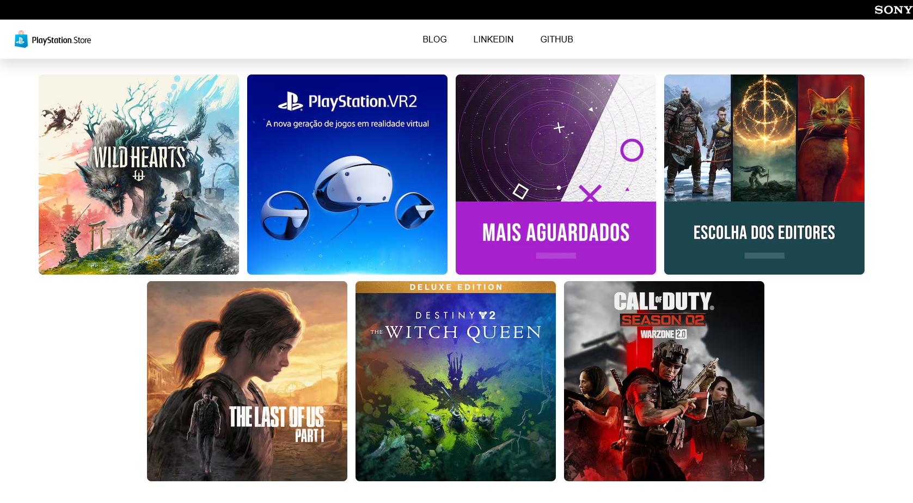
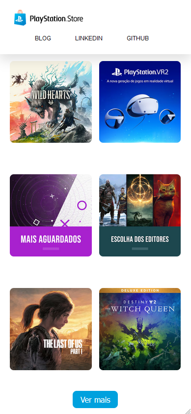

<!-- PROJECT LOGO -->
 

   

  <h3 align="center">Games Store</h3>

  

		Site construído em Angular.
     
     
		<!--
    <a href="https://github.com/othneildrew/Best-README-Template"><strong>Explore the docs »</strong></a>
     
     
    <a href="https://github.com/othneildrew/Best-README-Template">View Demo</a>
    ·
    <a href="https://github.com/othneildrew/Best-README-Template/issues">Report Bug</a>
    ·
    <a href="https://github.com/othneildrew/Best-README-Template/issues">Request Feature</a>
    -->
  

<!-- TABLE OF CONTENTS -->
## Table of Contents
  <ol>
    <li>
      <a href="#about-the-project">About The Project</a>
      <ul>
        <li><a href="#built-with">Built With</a></li>
      </ul>
    </li>
    <li><a href="#license">License</a></li>
    <li><a href="#contact">Contact</a></li>
    <li><a href="#acknowledgments">Acknowledgments</a></li>
  </ol>

<!-- ABOUT THE PROJECT -->
## About The Project

 

The web application created in Angular, which simulates the interface of Play Station's online store, uses various technological resources to ensure a pleasant and intuitive browsing experience for users. To achieve this, the project uses the Angular framework, which allows creating reusable components, making the development more efficient and easier.

In addition, the application has a modern and responsive layout created with HTML and CSS that adapts to different devices, from desktop computers to smartphones and tablets. The application's interface is inspired by the Play Station online store, with a similar organization of elements and the same color palette.

### Built With

![Angular][Angular] ![TailwindCSS][Tailwind]

(<a href="#readme-top">back to top</a>)

<!-- LICENSE -->
## License

Distributed under the MIT License. See `LICENSE.txt` for more information.

(<a href="#readme-top">back to top</a>)

<!-- CONTACT -->
## Contact

[![LinkedIn][linkedin-shield]][linkedin-url]
[![Site][site-shield]][site-url]

(<a href="#readme-top">back to top</a>)

<!-- ACKNOWLEDGMENTS -->
## Acknowledgments

* [Game icon by Icons8](https://icons8.com/icon/rCMgUHUAhuWi/video-game)

(<a href="#readme-top">back to top</a>)

  Built with ❤︎ by <a href="https://josafa.com.br">Josafá Marengo</a>

<!-- MARKDOWN LINKS & IMAGES -->
<!-- https://www.markdownguide.org/basic-syntax/#reference-style-links -->

[linkedin-shield]: https://img.shields.io/badge/LinkedIn-0077B5?style=for-the-badge&logo=linkedin&logoColor=white
[linkedin-url]: https://linkedin.com/in/josafamarengo

[email-shield]: https://img.shields.io/badge/Gmail-D14836?style=for-the-badge&logo=gmail&logoColor=white
[email-url]: https://josafa.com.br/#contact

[site-shield]: https://img.shields.io/badge/website-000000?style=for-the-badge&logo=About.me&logoColor=white
[site-url]: https://josafa.com.br

<!-- Languages -->
[AWS]: https://img.shields.io/badge/Amazon_AWS-FF9900?style=for-the-badge&logo=amazonaws&logoColor=white
[Actions]: https://img.shields.io/badge/GitHub_Actions-2088FF?style=for-the-badge&logo=github-actions&logoColor=white
[Next]: https://img.shields.io/badge/next.js-000000?style=for-the-badge&logo=nextdotjs&logoColor=white
[React]: https://img.shields.io/badge/React-20232A?style=for-the-badge&logo=react&logoColor=61DAFB
[Native]: https://img.shields.io/badge/React_Native-20232A?style=for-the-badge&logo=react&logoColor=61DAFB
[Kotlin]: https://img.shields.io/badge/Kotlin-0095D5?&style=for-the-badge&logo=kotlin&logoColor=white
[Swift]: https://img.shields.io/badge/Swift-FA7343?style=for-the-badge&logo=swift&logoColor=white
[Redux]: https://img.shields.io/badge/Redux-593D88?style=for-the-badge&logo=redux&logoColor=white
[Vue]: https://img.shields.io/badge/Vue.js-35495E?style=for-the-badge&logo=vuedotjs&logoColor=4FC08D
[Angular]: https://img.shields.io/badge/Angular-DD0031?style=for-the-badge&logo=angular&logoColor=white
[Styled]: https://img.shields.io/badge/styled--components-DB7093?style=for-the-badge&logo=styled-components&logoColor=white
[Tailwind]: https://img.shields.io/badge/Tailwind_CSS-38B2AC?style=for-the-badge&logo=tailwind-css&logoColor=white
[SaSS]: https://img.shields.io/badge/Sass-CC6699?style=for-the-badge&logo=sass&logoColor=white
[Rust]: https://img.shields.io/badge/Rust-000000?style=for-the-badge&logo=rust&logoColor=white
[Python]: https://img.shields.io/badge/Python-14354C?style=for-the-badge&logo=python&logoColor=white
[R]: https://img.shields.io/badge/R-276DC3?style=for-the-badge&logo=r&logoColor=white
[Oracle]: https://img.shields.io/badge/Oracle-F80000?style=for-the-badge&logo=Oracle&logoColor=white
[Elastic]: https://img.shields.io/badge/Elastic_Search-005571?style=for-the-badge&logo=elasticsearch&logoColor=white
[Mongo]: https://img.shields.io/badge/MongoDB-4EA94B?style=for-the-badge&logo=mongodb&logoColor=white
[MySQL]: https://img.shields.io/badge/MySQL-005C84?style=for-the-badge&logo=mysql&logoColor=white
[Neo4J]: https://img.shields.io/badge/Neo4j-018bff?style=for-the-badge&logo=neo4j&logoColor=white
[Redis]: https://img.shields.io/badge/redis-%23DD0031.svg?&style=for-the-badge&logo=redis&logoColor=white
[SQLite]: https://img.shields.io/badge/SQLite-07405E?style=for-the-badge&logo=sqlite&logoColor=white
[PostgreSQL]: https://img.shields.io/badge/PostgreSQL-316192?style=for-the-badge&logo=postgresql&logoColor=white
